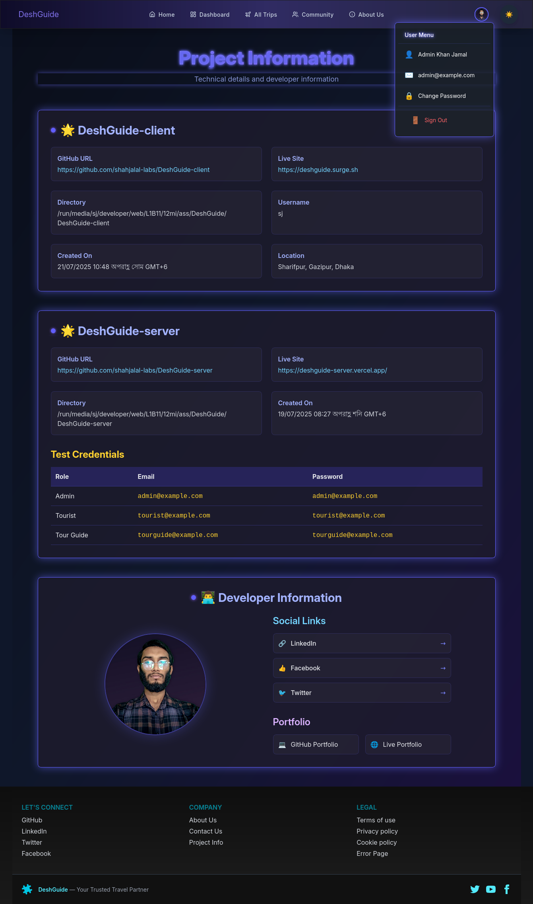

# 🌟 reactroutertailwinddaisyuistarter

## 📂 Project Information

| 📝 **Detail**           | 📌 **Value**                                                              |
|------------------------|---------------------------------------------------------------------------|
| 🔗 **GitHub URL**       | [https://github.com/shahjalal-labs/reactroutertailwinddaisyuistarter](https://github.com/shahjalal-labs/reactroutertailwinddaisyuistarter)                                                                  |
| 🌐 **Live Site**        | [http://shahjalal-mern.surge.sh](http://shahjalal-mern.surge.sh)                                                                  |
| 💻 **Portfolio GitHub** | [https://github.com/shahjalal-labs/shahjalal-portfolio-v2](https://github.com/shahjalal-labs/shahjalal-portfolio-v2)                                                                  |
| 🌐 **Portfolio Live**   | [http://shahjalal-labs.surge.sh](http://shahjalal-labs.surge.sh)                                                                  |
| 📁 **Directory**        | `/run/media/sj/developer/web/L1B11/12mi/ass/DeshGuide/reacttailwinddaisyuistarter`                                                                      |
| 📅 **Created On**       | `24/08/2025 06:12 পূর্বাহ্ণ রবি GMT+6`                                                                      |
| 📍 **Location**         | Sharifpur, Gazipur, Dhaka                                                                        |
| 💼 **LinkedIn**         | [https://www.linkedin.com/in/shahjalal-labs/](https://www.linkedin.com/in/shahjalal-labs/)                                                                  |
| 📘 **Facebook**         | [https://www.facebook.com/shahjalal.labs](https://www.facebook.com/shahjalal.labs)                                                                  |
| ▶️ **Twitter**          | [https://x.com/shahjalal_labs](https://x.com/shahjalal_labs)                                                                  |

---
### `Developer info:`


> 🚀 
> 🧠 

# 🌟 DeshGuide - Tourism Management System

A comprehensive tourism management platform built with React, featuring multi-role authentication, package booking, story sharing, and administrative controls for exploring Bangladesh's tourist destinations.


## 🎯 Key Features

- 🔐 **Multi-Role Authentication** - Role-based access for Tourists, Tour Guides, and Admins
- 🏞️ **Package Management** - Browse and book tour packages with detailed information
- 👥 **Tour Guide Profiles** - Detailed profiles with assigned tours and stories
- 📖 **Story Sharing** - Community-driven travel stories with social sharing
- 💳 **Stripe Payment Integration** - Secure payment processing for bookings
- 📱 **Responsive Design** - Mobile-first design with Tailwind CSS
- 🎨 **Modern UI/UX** - Framer Motion animations and interactive components
- 🔒 **Protected Routes** - JWT-based authentication with persistent sessions
- 📊 **Admin Dashboard** - Comprehensive analytics and user management
- 🌐 **Real-time Updates** - TanStack Query for efficient data fetching

## ⚙️ Tech Stack

| 🧩 **Category**         | 🚀 **Technologies Used**                |
| ----------------------- | --------------------------------------- |
| 🎨 **Frontend**         | React 19, Vite, Tailwind CSS, DaisyUI   |
| 🗂️ **State Management** | TanStack Query, React Context API       |
| 🔐 **Authentication**   | Firebase Auth, JSON Web Token (JWT)     |
| 🧱 **UI Components**    | Lucide React, React Icons, Lottie React |
| 🎞️ **Animations**       | Framer Motion, AOS (Animate On Scroll)  |
| 📝 **Forms**            | React Hook Form, React Select           |
| 💳 **Payment**          | Stripe                                  |
| 🧭 **Routing**          | React Router v7                         |
| 📅 **Date Handling**    | Date-fns, Day.js, React DatePicker      |
| 🏗️ **Build Tool**       | Vite                                    |

## 🌍 Live Demo

🔗 **Live Site**: [https://deshguide.surge.sh](https://deshguide.surge.sh)  
🎥 **Preview Video** [https://www.youtube.com/watch?v=V_u5M37B-es](https://www.youtube.com/watch?v=V_u5M37B-es) <br />
📂 **GitHub Client**: [https://github.com/shahjalal-labs/DeshGuide-client](https://github.com/shahjalal-labs/DeshGuide-client)  
🖥️ **GitHub Server**: [https://github.com/shahjalal-labs/DeshGuide-server](https://github.com/shahjalal-labs/DeshGuide-server)  
⚡ **Server URL**: [https://deshguide-server.vercel.app](https://deshguide-server.vercel.app)

### 🔑 Demo Credentials

| 👤 **Role**              | 📧 **Email**          | 🔒 **Password**       |
| ------------------------ | --------------------- | --------------------- |
| 🛡️ **Admin**             | admin@example.com     | admin@example.com     |
| 🧭 **Sample Tour Guide** | tourguide@example.com | tourguide@example.com |
| 🎒 **Sample Tourist**    | tourist@example.com   | tourist@example.com   |

---

## 🧭 Routing Structure

### 1️⃣ Routes Summary Table (Quick Overview)

| 🔗 **Route Path**   | 📝 **Purpose**                              | 🔐 **Auth Required** | 🧑‍💼 **Role Access** |
| ------------------- | ------------------------------------------- | -------------------- | ------------------ |
| `/`                 | 🏠 Home page with packages, guides, stories | No                   | Public             |
| `/all-trips`        | 🧳 All tour packages listing                | No                   | Public             |
| `/packages/:id`     | 📦 Package details with booking             | ✅ Yes               | All Users          |
| `/tour-guides`      | 🧭 All tour guides listing                  | No                   | Public             |
| `/guides/:id`       | 🧑‍✈️ Tour guide profile                       | ✅ Yes               | All Users          |
| `/community`        | 🗺️ All stories with sharing                 | No                   | Public             |
| `/community/:id`    | 🧾 Story details                            | ✅ Yes               | All Users          |
| `/about-us`         | 🧑‍🤝‍🧑 About us page                            | No                   | Public             |
| `/contact-us`       | 📞 Contact information                      | No                   | Public             |
| `/partner-signup`   | 🤝 Partner registration                     | No                   | Public             |
| `/project-info`     | ℹ️ Project information                      | No                   | Public             |
| `/auth/signin`      | 🔑 User login                               | No                   | Public             |
| `/auth/signup`      | 🆕 User registration                        | No                   | Public             |
| `/auth/forgot-pass` | 🧠 Password reset                           | No                   | Public             |
| `/dashboard/*`      | 📊 User dashboard routes                    | ✅ Yes               | 🎯 Role-based      |

### 2️⃣ Dashboard Routes (Role-based Access)

| Route Path                           | HTTP Method | Purpose            | Role Required | Components      |
| ------------------------------------ | ----------- | ------------------ | ------------- | --------------- |
| `/dashboard`                         | GET         | Profile management | All           | ManageProfile   |
| `/dashboard/my-bookings`             | GET         | Tourist bookings   | Tourist       | MyBookings      |
| `/dashboard/payment-booking/:id`     | POST        | Payment processing | Tourist       | PaymentBooking  |
| `/dashboard/tourist/join-tour-guide` | POST        | Guide application  | Tourist       | JoinTourGuide   |
| `/dashboard/manage-stories`          | GET         | Story management   | All           | ManageStories   |
| `/dashboard/add-stories`             | POST        | Story creation     | All           | AddStories      |
| `/dashboard/guide/my-assigned-tours` | GET         | Guide tours        | Tour Guide    | AssignedTour    |
| `/dashboard/admin/add-package`       | POST        | Package creation   | Admin         | AddPackage      |
| `/dashboard/admin/candidates`        | GET/PUT     | Guide applications | Admin         | ManageCandidate |
| `/dashboard/admin/manage-users`      | GET/PUT     | User management    | Admin         | ManageUsers     |
| `/dashboard/admin/bookings`          | GET         | All bookings       | Admin         | AllBookings     |
| `/dashboard/admin/payments`          | GET         | Payment records    | Admin         | AllPayments     |

### 3️⃣ Folder & Component Structure

| Folder / File Path       | Purpose / Role             | UI Features                      | Notes                |
| ------------------------ | -------------------------- | -------------------------------- | -------------------- |
| `src/modules/Auth/`      | Authentication system      | Login/Register forms, layouts    | Firebase integration |
| `src/modules/Dashboard/` | Dashboard components       | Role-based UI, management panels | Protected routes     |
| `src/modules/landing/`   | Landing page components    | Hero, packages, guides showcase  | Public sections      |
| `src/modules/Packages/`  | Package-related components | Package cards, details, booking  | Core business logic  |
| `src/modules/shared/`    | Reusable components        | Layout, UI components            | Cross-module usage   |
| `src/pages/`             | Static page components     | About, Contact, Legal pages      | SEO-friendly pages   |
| `src/hooks/`             | Custom React hooks         | Data fetching, auth, utilities   | Reusable logic       |
| `src/contexts/`          | React Context providers    | Auth state, global state         | State management     |
| `src/utils/`             | Utility functions          | API calls, helpers, alerts       | Pure functions       |
| `src/router/`            | Routing configuration      | Route definitions, guards        | Navigation logic     |
| `src/routes/`            | Route protection           | Role-based guards                | Security layer       |

## 🧱 Folder Structure

```
src/
├── animation/           # Lottie animations and motion configs
├── assets/             # Static assets (images, icons, previews)
├── contexts/           # React Context providers (Auth)
├── hooks/              # Custom hooks (useAuth, useFetchData, etc.)
├── modules/            # Feature-based modules
│   ├── Auth/           # Authentication components
│   ├── Dashboard/      # Dashboard layouts and components
│   ├── landing/        # Landing page sections
│   ├── Packages/       # Package-related components
│   └── shared/         # Shared components and layouts
├── pages/              # Static pages (About, Contact, Legal)
├── router/             # Route configuration and guards
├── routes/             # Role-based route protection
└── utils/              # Utility functions and helpers
```

## 🖼️ UI Preview

### 🖥️ Desktop View

**Home Page**  


**About Us Page**  


**Project Info Page**  


**Full website**

- [view the live site](deshguide.surge.sh)

### 💻 Laptop View

- [view the live site](deshguide.surge.sh)

### 📱 Mobile View

- [view the live site](deshguide.surge.sh)

## 🏁 Getting Started

### Prerequisites

- Node.js (v18+ recommended)
- npm or yarn or bun
- Firebase account for authentication
- MongoDB database
- Stripe account for payments

### 💻 Installation

1. **Clone the repository**

   ```bash
   git clone https://github.com/shahjalal-labs/DeshGuide-client.git
   cd DeshGuide-client
   ```

2. **Install dependencies**

   ```bash
   npm install
   # or
   yarn install
   # or
   bun install
   ```

3. **Set up environment variables**

   ```bash
   cp .env.example .env
   ```

4. **Start development server**

   ```bash
   npm run dev
   # or
   yarn dev
   # or
   bun run dev
   ```

5. **Open your browser**
   ```
   http://localhost:5173
   ```

## 🛠️ Environment Variables

Create a `.env` file in the root directory:

```env
# Firebase Configuration
VITE_FIREBASE_API_KEY=your_firebase_api_key
VITE_FIREBASE_AUTH_DOMAIN=your_project.firebaseapp.com
VITE_FIREBASE_PROJECT_ID=your_project_id
VITE_FIREBASE_STORAGE_BUCKET=your_project.appspot.com
VITE_FIREBASE_MESSAGING_SENDER_ID=your_sender_id
VITE_FIREBASE_APP_ID=your_app_id

# Backend API
VITE_API_BASE_URL=http://localhost:5000
# or production: https://deshguide-server.vercel.app

# Stripe (Optional)
VITE_STRIPE_PUBLISHABLE_KEY=pk_test_your_stripe_key
```

## 📤 Deployment

### Build for Production

```bash
npm run build
# or
yarn build
# or
bun run build
```

### Deploy to Surge

```bash
npm install -g surge
surge dist/ your-domain.surge.sh
```

### Deploy to Vercel

```bash
npm install -g vercel
vercel --prod
```

### Deploy to Netlify

```bash
npm install -g netlify-cli
netlify deploy --prod --dir=dist
```

## 📋 API Documentation

### Base URL

- **Development**: `http://localhost:5000`
- **Production**: `https://deshguide-server.vercel.app`

### Authentication Endpoints

- `POST /api/auth/login` - User login
- `POST /api/auth/register` - User registration
- `POST /api/auth/refresh` - Token refresh

### Package Endpoints

- `GET /api/packages` - Get all packages
- `GET /api/packages/:id` - Get package by ID
- `POST /api/packages` - Create package (Admin)
- `PUT /api/packages/:id` - Update package (Admin)
- `DELETE /api/packages/:id` - Delete package (Admin)

### Booking Endpoints

- `GET /api/bookings` - Get user bookings
- `POST /api/bookings` - Create booking
- `PUT /api/bookings/:id` - Update booking status
- `DELETE /api/bookings/:id` - Cancel booking

### Story Endpoints

- `GET /api/stories` - Get all stories
- `GET /api/stories/:id` - Get story by ID
- `POST /api/stories` - Create story
- `PUT /api/stories/:id` - Update story
- `DELETE /api/stories/:id` - Delete story

## 🧪 Testing

### Run Tests

```bash
npm run test
# or
yarn test
# or
bun test
```

### Linting

```bash
npm run lint
# or
yarn lint
# or
bun run lint
```

## 🎯 Project Goals

- **Tourism Promotion**: Showcase Bangladesh's natural beauty and cultural heritage
- **User Experience**: Provide intuitive booking and story-sharing platform
- **Community Building**: Connect travelers with local tour guides
- **Business Growth**: Support tourism industry with digital solutions
- **Technology Innovation**: Demonstrate modern web development practices

## 👥 Contributing

We welcome contributions! Please see our [Contributing Guidelines](CONTRIBUTING.md) for details.

### Development Workflow

1. Fork the repository
2. Create a feature branch (`git checkout -b feature/amazing-feature`)
3. Commit your changes (`git commit -m 'Add amazing feature'`)
4. Push to the branch (`git push origin feature/amazing-feature`)
5. Open a Pull Request

### Code Style

- Use ESLint configuration provided
- Follow React best practices
- Write meaningful commit messages
- Add JSDoc comments for complex functions

## 🧑‍💻 Developers

| Developer     | Role                 | Contact                                                 |
| ------------- | -------------------- | ------------------------------------------------------- |
| **Shahjalal** | Full Stack Developer | [LinkedIn](https://www.linkedin.com/in/shahjalal-labs/) |

### Developer Portfolio

- **GitHub**: [https://github.com/shahjalal-labs/shahjalal-portfolio-v2](https://github.com/shahjalal-labs/shahjalal-portfolio-v2)
- **Live Portfolio**: [http://shahjalal-labs.surge.sh](http://shahjalal-labs.surge.sh)
- **Facebook**: [https://www.facebook.com/shahjalal.labs](https://www.facebook.com/shahjalal.labs)

## 📄 License

This project is licensed under the MIT License - see the [LICENSE.md](LICENSE.md) file for details.

## 📞 Contact

- **Email**: contact@deshguide.com
- **Location**: Sharifpur, Gazipur, Dhaka, Bangladesh
- **Project Directory**: `/run/media/sj/developer/web/L1B11/12mi/ass/DeshGuide/DeshGuide-client`

## 🔒 Security

### Reporting Security Issues

If you discover a security vulnerability, please send an email to security@deshguide.com. All security vulnerabilities will be promptly addressed.

### Security Features

- JWT-based authentication
- Protected routes with role validation
- Secure payment processing with Stripe
- Environment variable protection
- Input validation and sanitization

## 📌 Acknowledgements

- **Firebase** for authentication services
- **MongoDB** for database solutions
- **Stripe** for payment processing
- **Vercel** for hosting services
- **Tailwind CSS** for styling framework
- **React Community** for excellent ecosystem

## 🪵 Changelog

### Version 1.0.0 (Current)

- ✅ Initial release with core features
- ✅ Multi-role authentication system
- ✅ Package booking functionality
- ✅ Story sharing community
- ✅ Payment integration
- ✅ Responsive design
- ✅ Admin dashboard

### Upcoming Features

- 🔄 Real-time notifications
- 🔄 Mobile app version
- 🔄 Advanced search filters
- 🔄 Review and rating system
- 🔄 Multi-language support

## 🧭 Navigation Index

- [🌍 Live Demo](#-live-demo)
- [🧭 Routing Structure](#-routing-structure)
- [🧱 Folder Structure](#-folder-structure)
- [🖼️ UI Preview](#-ui-preview)
- [🏁 Getting Started](#-getting-started)
- [💻 Installation](#-installation)
- [📤 Deployment](#-deployment)
- [🛠️ Environment Variables](#-environment-variables)
- [📋 API Documentation](#-api-documentation)
- [🧪 Testing](#-testing)
- [🎯 Project Goals](#-project-goals)
- [👥 Contributing](#-contributing)
- [🧑‍💻 Developers](#-developers)
- [📄 License](#-license)
- [📞 Contact](#-contact)
- [🔒 Security](#-security)
- [📌 Acknowledgements](#-acknowledgements)
- [🪵 Changelog](#-changelog)

---

<div align="center">

**Built with ❤️ by [Shahjalal Labs](https://github.com/shahjalal-labs)**


</div>

### 🌐 Developer Social Links

| Platform         | Link                                                                                       |
| ---------------- | ------------------------------------------------------------------------------------------ |
| 💼 **LinkedIn**  | [https://www.linkedin.com/in/shahjalal-labs/](https://www.linkedin.com/in/shahjalal-labs/) |
| 📘 **Facebook**  | [https://www.facebook.com/shahjalal.labs](https://www.facebook.com/shahjalal.labs)         |
| 💻 **Portfolio** | [http://shahjalal-labs.surge.sh](http://shahjalal-labs.surge.sh)                           |
| 🔗 **GitHub**    | [https://github.com/shahjalal-labs](https://github.com/shahjalal-labs)                     |
| ▶️ **YouTube**   | [https://www.youtube.com/@shahjalal-labs](https://www.youtube.com/@shahjalal-labs)         |

---

## 📋 Project Metadata

| 📝 **Detail**           | 📌 **Value**                                                                                                         |
| ----------------------- | -------------------------------------------------------------------------------------------------------------------- |
| 💻 **Portfolio GitHub** | [https://github.com/shahjalal-labs/shahjalal-portfolio-v2](https://github.com/shahjalal-labs/shahjalal-portfolio-v2) |
| 🌐 **Portfolio Live**   | [http://shahjalal-labs.surge.sh](http://shahjalal-labs.surge.sh)                                                     |
| 📁 **Directory**        | `/run/media/sj/developer/web/L1B11/12mi/ass/DeshGuide/DeshGuide-client`                                              |
| 📅 **Created On**       | `21/07/2025 10:48 অপরাহ্ণ সোম GMT+6`                                                                                 |
| 📍 **Location**         | Sharifpur, Gazipur, Dhaka                                                                                            |
| 💼 **LinkedIn**         | [https://www.linkedin.com/in/shahjalal-labs/](https://www.linkedin.com/in/shahjalal-labs/)                           |

| 📘 **Facebook** | [https://www.facebook.com/shahjalal.labs](https://www.facebook.com/shahjalal.labs) |
| ▶️ **Twitter** | [shahjalal_labs](https://www.x.com/shahjalal_labs) |